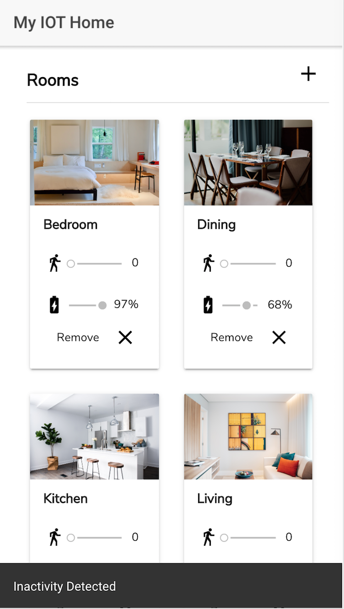

# MyHome MQTT Concept App with Ionic
MyHome was created for SWEN 325 at Victoria University of Wellington in New Zealand. 
You can view the project report here: 

## Overview ##
MyHome is a concept MQTT mobile app for detecting motion in a smarthome. The mobile app subscribes to an MQTT broker streaming data from multiple in-home motion sensors. This app allows the user to see when the last recorded activity was for the sensor and sends a push notification if there has been no recorded motion for the last five minutes. The broker was streaming fake data and was provided by the University, therefore a sample of this app is not possible.
There is only one screen on the mobile app. The project specified that user experience and design should be highly considered. This is discussed in the attached report.

| Landing Page & Connection Status  | Rooms & Inactivity Notification | Rooms Activity |
| ------------- | ------------- | ------------- |
|   |   |  |

| Landing page of the app. Users can see the connection status and the last activity detected in the smart home. | Users can scroll down to see all the rooms in the smart home with the option to add a new room. The Material-Design snackbar shows the user there has not been activity in the house.  | The rooms page changes based on the sensors data. In this screenshot, the house has had three events of activity in the bedroom and zero events in the living room. This value updates with the state as data is recieved from the data stream. |

## Clone & Demo ##
Due to the nessessity to be on the local network of the University to access the MQTT broker, this app cannot be demoed off-campus. Screenshots are available above and the project report is attached in the repo. The project is purely posted for code review at this time.